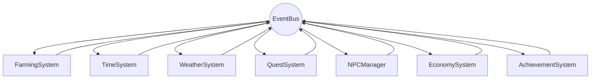

# Green Valley — Architecture

> System design of a pixel-art farming simulation built from scratch with no game engine

---

## Table of Contents

- [Design Philosophy](#design-philosophy)
- [Game Loop](#game-loop)
- [Rendering Pipeline](#rendering-pipeline)
- [Entity Architecture](#entity-architecture)
- [Game Systems](#game-systems)
- [Genetics Engine](#genetics-engine)
- [World Structure](#world-structure)
- [UI Architecture](#ui-architecture)
- [Persistence](#persistence)

---

## Design Philosophy

Green Valley is built on deliberate constraints:

| Decision | Rationale |
|----------|-----------|
| **No game engine** | Full understanding and control of every system |
| **No frameworks** | Vanilla JS with ES6 modules — no React, no Vue |
| **No build tools** | Runs directly in the browser, no webpack/vite/bundler |
| **Canvas 2D** | Pixel-art rendering with full control over every pixel |
| **Modular architecture** | Feature-based modules with clear boundaries |
| **Event-driven** | Loose coupling between systems via EventBus |

---

## Game Loop

The core heartbeat of the game:

```
┌──────────────────────────────────────┐
│           requestAnimationFrame       │
│                                      │
│  ┌────────────────────────────────┐  │
│  │  1. Calculate Delta Time       │  │
│  │     (frame-independent timing) │  │
│  └────────────────┬───────────────┘  │
│                   │                  │
│  ┌────────────────▼───────────────┐  │
│  │  2. UPDATE Phase               │  │
│  │     • InputManager.handle()    │  │
│  │     • World.update(dt)         │  │
│  │     • FarmingSystem.update(dt) │  │
│  │     • TimeSystem.update(dt)    │  │
│  │     • WeatherSystem.update(dt) │  │
│  │     • NPCManager.update(dt)    │  │
│  │     • QuestSystem.update(dt)   │  │
│  │     • AchievementSystem.check()│  │
│  └────────────────┬───────────────┘  │
│                   │                  │
│  ┌────────────────▼───────────────┐  │
│  │  3. RENDER Phase               │  │
│  │     • Renderer.clear()         │  │
│  │     • Renderer.drawWorld()     │  │
│  │     • Renderer.drawEntities()  │  │
│  │     • Renderer.drawUI()        │  │
│  └────────────────┬───────────────┘  │
│                   │                  │
│  ┌────────────────▼───────────────┐  │
│  │  4. FPS Tracking               │  │
│  │     • frameCount++             │  │
│  │     • requestAnimationFrame()  │  │
│  └────────────────────────────────┘  │
└──────────────────────────────────────┘
```

**Key properties:**
- **Delta time** — All movement/animation is frame-rate independent
- **Fixed update order** — Deterministic system execution sequence
- **Separate update/render** — Logic and drawing are decoupled

---

## Rendering Pipeline

### Canvas 2D Architecture

```
┌─────────────────────────────────────────┐
│           EnhancedRenderer               │
│                                          │
│  Canvas Context (2D)                     │
│  ├── imageSmoothingEnabled: false        │
│  │   (crisp pixel art, no anti-alias)    │
│  │                                       │
│  ├── Camera System                       │
│  │   • Viewport tracking (follows player)│
│  │   • World-to-screen coordinate map    │
│  │   • Zone-based boundaries             │
│  │                                       │
│  ├── Sprite System                       │
│  │   • SpriteSheet (atlas-based)         │
│  │   • Grid-cell frame extraction        │
│  │   • Animation frame cycling           │
│  │   • Directional sprites (4-way)       │
│  │                                       │
│  ├── Layer Order                         │
│  │   1. Background / terrain tiles       │
│  │   2. Ground objects (crops, plots)    │
│  │   3. Buildings                        │
│  │   4. Entities (player, NPCs)          │
│  │   5. Particles / effects              │
│  │   6. UI overlay / HUD                 │
│  │                                       │
│  └── Effects                             │
│      • Lighting (day/night tint)         │
│      • Particles (harvest sparkle, etc.) │
│      • Transitions (scene fades/wipes)   │
└─────────────────────────────────────────┘
```

### Spritesheet System

All visual assets are packed into optimized spritesheets:

| Sheet | Dimensions | Cell Size | Content |
|-------|-----------|-----------|---------|
| NPC Portraits | 320×240 | 80×80 | Character face images |
| NPC Sprites | 288×144 | 32×48 | Walking animations (4 dirs) |
| Player | 128×192 | 32×48 | Player variants (4 dirs) |
| Items | 256×256 | 32×32 | 64 item icons (8×8 grid) |
| Tools | 160×32 | 32×32 | 5 tool icons |
| Buildings | Various | Various | Transparent PNGs |

---

## Entity Architecture

### Player

```
Player {
  position: { x, y }
  stats: {
    stamina: 0-100
    health: 0-100
  }
  skills: {
    farming:    { level, xp }
    breeding:   { level, xp }
    processing: { level, xp }
    social:     { level, xp }
  }
  wallet: { gold }
  inventory: Item[32]     // 8×4 grid
  hotbar: Item[8]         // Quick access
  selectedTool: Tool
  selectedSlot: number
}
```

### NPC

```
NPC {
  id, name, age
  occupation: "herbalist" | "farmer" | "merchant" | ...
  personality: "curious" | "friendly" | "serious" | ...
  location: { zone, x, y }
  currentAction: string
  
  schedule: {
    [dayOfWeek]: {
      [hour]: { location, activity }
    }
  }
  
  relationship: {
    level: 0-300+
    tier: "stranger" | "friend" | "bestFriend" | "close"
  }
  
  gifts: {
    loved:    Item[]   // +3 points
    liked:    Item[]   // +1 point
    neutral:  Item[]   //  0 points
    disliked: Item[]   // -1 point
    hated:    Item[]   // -3 points
  }
  
  dialogue: {
    casual: string[]
    quest: string[]
    [relationshipTier]: string[]
  }
}
```

### Plant

```
Plant {
  name, type, strain
  growthStage: "seed" | "seedling" | "vegetative" | "flowering" | "harvestable" | "wilted"
  growthProgress: 0.0 - 1.0
  age: number
  
  health: 0-100
  waterLevel: 0-100
  quality: "low" | "medium" | "high"
  
  isWatered: boolean
  isFertilized: boolean
  
  genome: Genome
  color: { r, g, b }
  generation: number
}
```

---

## Game Systems

### System Communication

All systems communicate through the EventBus — loose coupling prevents spaghetti dependencies:



**Example event flow:**
```
Player harvests crop
  → FarmingSystem emits "crop:harvested" { plant, quality, yield }
  → QuestSystem checks harvest quest progress
  → AchievementSystem checks "harvest 100 crops"
  → EconomySystem updates market supply
  → Player skill XP increases
```

### System Responsibility Map

| System | Singleton | Events Emitted | Events Consumed |
|--------|-----------|---------------|-----------------|
| **FarmingSystem** | Yes | crop:planted, crop:harvested, crop:wilted | time:tick, weather:changed |
| **TimeSystem** | Yes | time:tick, time:hourChanged, time:dayChanged, time:seasonChanged | — |
| **WeatherSystem** | Yes | weather:changed | time:dayChanged, time:seasonChanged |
| **QuestSystem** | Yes | quest:completed, quest:updated | crop:harvested, npc:gift, building:built |
| **NPCManager** | Yes | npc:dialogue, npc:gift | time:hourChanged, time:dayChanged |
| **EconomySystem** | Yes | economy:transaction | time:dayChanged, crop:harvested |
| **EnergySystem** | Yes | energy:depleted, energy:restored | time:sleepStarted |
| **ShopSystem** | Yes | shop:purchase, shop:sale | time:dayChanged (restock) |
| **CraftingSystem** | Yes | crafting:complete | — |
| **AchievementSystem** | Yes | achievement:unlocked | (listens to many) |

---

## Genetics Engine

The most complex system in the game.

### Breeding Algorithm

```
Parent A (Genome)          Parent B (Genome)
    │                          │
    ├── yield: 0.8             ├── yield: 0.6
    ├── quality: 0.7           ├── quality: 0.9
    ├── growth_speed: 0.5      ├── growth_speed: 0.7
    ├── water_eff: 0.6         ├── water_eff: 0.4
    └── color: [r1,g1,b1]     └── color: [r2,g2,b2]
                │
                ▼
┌──────────────────────────────────────┐
│          Breeding Function            │
│                                      │
│  For each trait:                     │
│    1. Average parent values          │
│    2. Apply random variation (±0.1)  │
│    3. Roll for mutation (5% chance)  │
│       → If mutated: ±0.2 variance   │
│    4. Clamp to valid range [0, 1]   │
│                                      │
│  Color:                              │
│    Mix parent colors (weighted avg)  │
│    Apply small random hue shift      │
│                                      │
│  Generation:                         │
│    max(parentA.gen, parentB.gen) + 1 │
└──────────────────────────────────────┘
                │
                ▼
         Offspring (Genome)
         ├── yield: 0.72 (averaged + variation)
         ├── quality: 0.85 (MUTATED — +0.05 bonus)
         ├── growth_speed: 0.58
         ├── water_eff: 0.52
         ├── color: [mixed]
         └── generation: 2
```

### Strain Discovery

```
Breeding result
    │
    ▼
┌─────────────────────────────────┐
│  StrainRegistry.checkDiscovery() │
│                                  │
│  Compare offspring genome to:    │
│  • Starter strain thresholds     │
│  • Rare strain thresholds        │
│  • Legendary strain thresholds   │
│                                  │
│  If genome matches a registered  │
│  strain's requirements:          │
│    → Strain discovered!          │
│    → Achievement unlock           │
│    → Quest progress               │
└─────────────────────────────────┘
```

---

## World Structure

### Zone System

```
┌─────────────────────────────────────────┐
│                 GameWorld                 │
│                                          │
│  ┌──────┐  ┌──────┐  ┌──────┐          │
│  │ Farm │──│ Town │──│Forest│          │
│  │      │  │      │  │      │          │
│  └──┬───┘  └──────┘  └──┬───┘          │
│     │                    │               │
│  ┌──┴────────┐     ┌────┴───┐          │
│  │Greenhouse │     │  Cave  │          │
│  │           │     │        │          │
│  └───────────┘     └────────┘          │
│                                          │
│  Each zone:                              │
│  • TileMap (collision, interaction)      │
│  • NPCs (zone-assigned)                  │
│  • Entities (crops, buildings, items)    │
│  • Background art                        │
│  • Entry/exit points                     │
└─────────────────────────────────────────┘
```

### Tile System

- **Grid-based** — World divided into uniform tiles
- **Collision layers** — Walkable, blocked, interactable
- **Interaction triggers** — Tiles that trigger actions (doors, NPCs, crops)
- **Zone transitions** — Edge tiles that transport to adjacent zones

---

## UI Architecture

```
UIManager
├── HUD (always visible)
│   ├── Time display (hour, day, season)
│   ├── Weather indicator
│   ├── Energy bar
│   ├── Gold counter
│   ├── Selected tool
│   └── Hotbar (8 slots)
│
├── Menus (overlay)
│   ├── MainMenu (title screen)
│   ├── PauseMenu (ESC)
│   └── SettingsMenu (audio, controls)
│
├── Dialogs (modal)
│   ├── NPCDialogSystem (conversation UI)
│   ├── ShopDialogUI (buy/sell interface)
│   └── ConfirmDialog (yes/no prompts)
│
├── Panels (toggleable)
│   ├── InventoryUI (I key, 8×4 grid)
│   ├── JournalUI (quest + achievement log)
│   └── MapUI (zone overview)
│
└── Rendering
    • All UI drawn on Canvas (no HTML overlay)
    • Z-ordered above game world
    • Resolution-independent scaling
```

---

## Persistence

### Save System

```
Player triggers Save
    │
    ▼
┌─────────────────────────────────────┐
│  SaveManager.save()                  │
│                                      │
│  1. Serialize game state:            │
│     • Player (position, stats,       │
│       skills, inventory, wallet)     │
│     • Farm (plots, crops, buildings) │
│     • NPCs (relationships, gifts)   │
│     • Quests (progress, completion)  │
│     • Time (day, season, year)       │
│     • Achievements (unlocked)        │
│     • World state (zone data)        │
│                                      │
│  2. Compress to Base64 string        │
│                                      │
│  3. Store in localStorage            │
│                                      │
│  Fallback: graceful degradation      │
│  if localStorage unavailable         │
└─────────────────────────────────────┘
```

---

*This document describes the architectural design of Green Valley. The source code is proprietary and not publicly available.*

**© 2024-2026 DevStudio AI. All rights reserved.**
